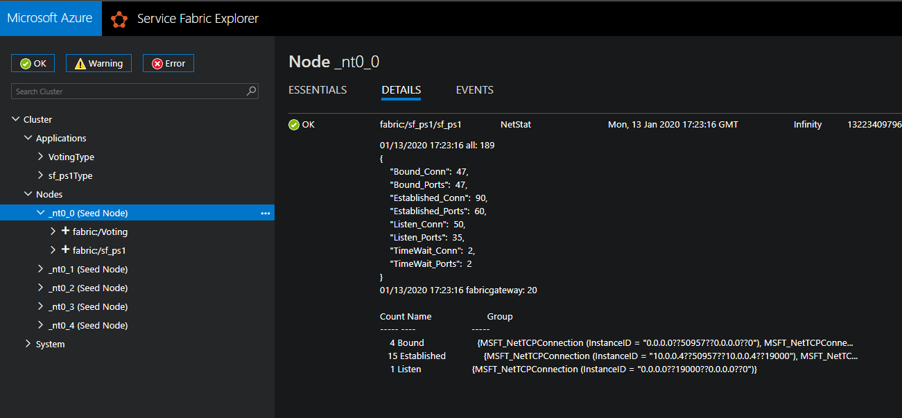

# sf-ps1

## Overview
sf-ps1 runs a powershell script inside a stateless service fabric application to monitor all and fabricgateway network connections. 

by default, the script will send a Send-ServiceFabricNodeHealthReport every minute with statistics as shown below  

script will warn on more than 900 fabricgateway connections  
script will error on 1000 or more fabricgateway connections  

